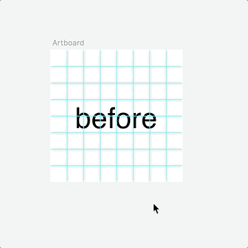

# Fix Sketch Trackpad Speed

Sketch plugin that speeds up scrolling across all artboards. Read [more details](http://sketchplugins.com/d/481-mscontentdrawview-scrollwheelscroll-and-calculating-sketch-viewport) and [the rest](https://www.google.com/search?q=trackpad+slow+sketch). [Check more plugins from author](https://pravdomil.com/#sketch).

[**Watch video**](https://youtu.be/OPIw7HX1ILI)

## Install

Via [Sketch Runner](http://sketchrunner.com) or [Sketchpacks](https://sketchpacks.com/pravdomil/FixSketchTrackpadSpeed) or [manual](../../releases).

## Backers
[Nick Sarafa](https://github.com/nsarafa). Become a backer by [buying a beer](https://www.paypal.com/cgi-bin/webscr?cmd=_s-xclick&hosted_button_id=BCL2X3AFQBAP2&item_name=Fix%20Sketch%20Trackpad%20Speed%20Beer).
